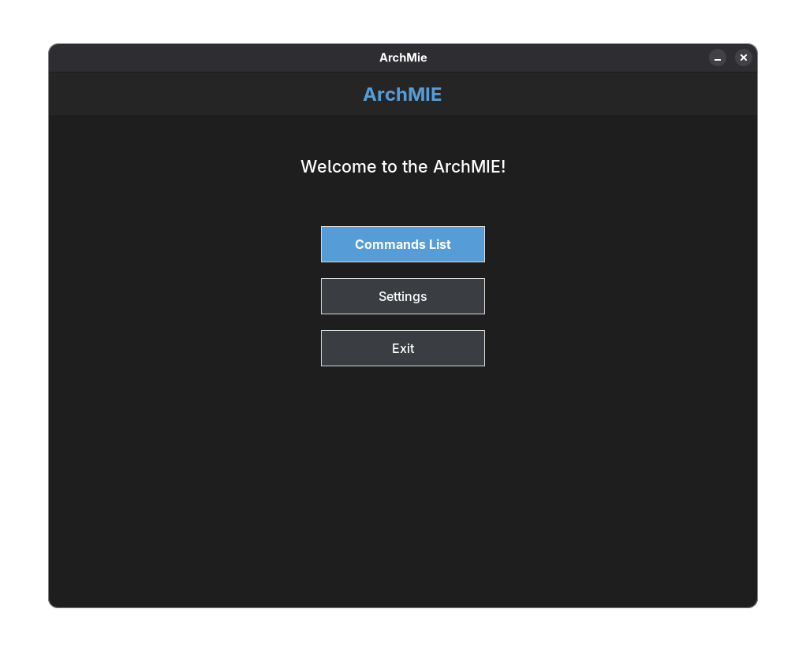
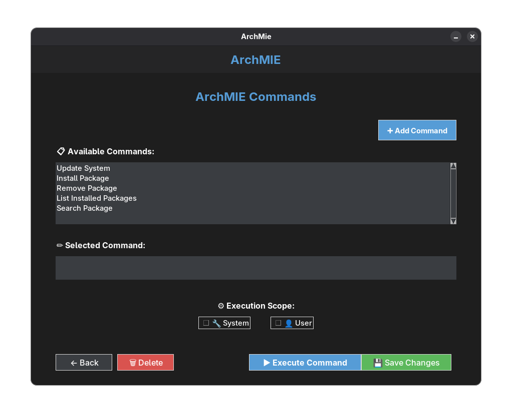
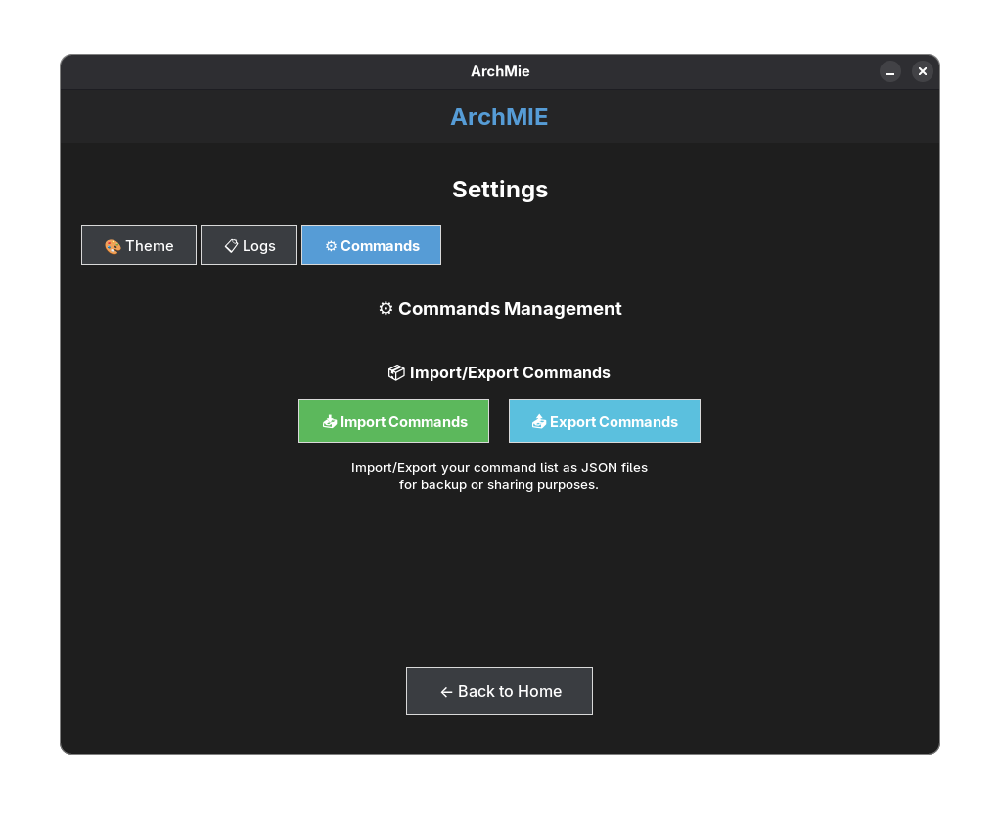
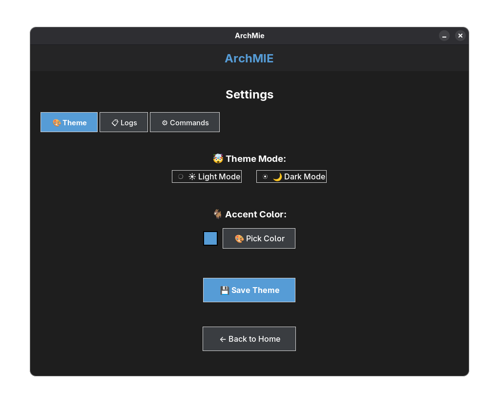

# 🚀 ArchMIE - Arch Linux "Make It Easy"
## Management Interface & Environment

<div align="center">


**A modern, user-friendly GUI application for managing Arch Linux system commands with style and security.**

[Features](#-features) • [Installation](#-installation) • [Usage](#-usage) • [Documentation](#-documentation) • [Contributing](#-contributing)

</div>

---

## 📋 Table of Contents

- [🌟 Features](#-features)
- [🔧 Installation](#-installation)
- [🚀 Usage](#-usage)
- [📸 Screenshots](#-screenshots)
- [⚙️ Configuration](#️-configuration)
- [🔒 Security](#-security)
- [📝 Logging](#-logging)
- [📦 Import/Export](#-importexport)
- [🎨 Theming](#-theming)
- [📚 Documentation](#-documentation)
- [🤝 Contributing](#-contributing)
- [📜 License](#-license)
- [🐛 Troubleshooting](#-troubleshooting)

---

## 🌟 Features

### 🎯 **Core Functionality**
- **🖥️ Intuitive GUI** - Clean, modern interface built with Tkinter
- **📋 Command Management** - Add, edit, delete, and organize system commands
- **🔐 Secure Authentication** - Password dialog for sudo commands
- **⚙️ System & User Scope** - Execute commands with appropriate privileges
- **📊 Real-time Logging** - Track all command executions and results

### 🎨 **User Experience**
- **🌙 Dark/Light Themes** - Toggle between modern theme modes
- **🎨 Customizable Colors** - Pick your preferred accent color
- **📱 Responsive Design** - Adaptive interface that works smoothly
- **🔄 Auto-refresh** - Real-time updates and status monitoring

### 🛠️ **Advanced Features**
- **📥📤 Import/Export** - Backup and share command configurations
- **📋 System Logs** - Comprehensive logging with timestamp tracking
- **🔍 Command Validation** - Smart validation and error handling
- **⏱️ Timeout Protection** - Prevents hanging on long-running commands

---

## 🔧 Installation

### Prerequisites

- **Python 3.8+** (usually pre-installed on Arch Linux)
- **Tkinter** (included with Python)
- **Arch Linux** (primary target platform)

### Quick Install

```bash
# Clone the repository
git clone https://github.com/bgusenda/ArchMIE.git

# Navigate to the directory
cd ArchMIE

# Make executable (optional)
chmod +x index.py

# Run the application
python index.py
```

### Alternative Installation

```bash
# Download as ZIP and extract
wget https://github.com/bgusenda/ArchMIE/archive/main.zip
unzip main.zip
cd ArchMIE-main
python index.py
```

---

## 🚀 Usage

### Starting the Application

```bash
python index.py
```

### Basic Workflow

1. **🏠 Homepage** - Main interface with navigation options
2. **📋 Commands** - Manage your system commands
3. **⚙️ Settings** - Configure themes, view logs, and manage data

### Adding Commands

1. Navigate to **Commands List**
2. Click **➕ Add Command**
3. Enter command name and actual command
4. Save and use immediately

### Executing Commands

1. Select a command from the list
2. Choose execution scope (System/User)
3. For sudo commands, enter your password when prompted
4. Confirm execution in the dialog
5. View results and logs

---

## 📸 Screenshots

### 🏠 Main Interface
*Clean, modern homepage with easy navigation*


### 📋 Command Management
*Organize and execute system commands with ease*


### ⚙️ Settings Panel
*Tabbed interface for themes, logs, and data management*


### 🎨 Theme Customization
*Light/Dark modes with custom accent colors*


---

## ⚙️ Configuration

### File Structure

### File Structure

```
ArchMIE/
├── 📁 assets/                # Visual resources
│   ├── archmie.png          # Application icon (PNG)
│   └── archmie.svg          # Application icon (SVG)
├── 📁 docs/                 # Documentation
│   ├── CHANGELOG.md         # Version history and changes
│   ├── CODE_OF_CONDUCT.md   # Community guidelines
│   ├── CONTRIBUTING.md      # Contribution guide
│   └── RELEASE_GUIDE.md     # Release process guide
├── 📁 packaging/            # Distribution files
│   ├── PKGBUILD            # Arch Linux package build
│   └── archmie.desktop     # Desktop entry file
├── 📁 pages/               # GUI pages and components
│   ├── commands_page.py    # Command management interface
│   └── settings_page.py    # Settings and configuration
├── 🐍 index.py             # Main application entry point
├── 🔧 utils.py             # Utility functions (auth, logging, etc.)
├── 🎨 theme_variables.py   # Theme management
├── 📜 LICENSE              # GNU GPL v3.0 License
├── 📖 README.md            # This file
├── 📁 .github/             # GitHub configuration
│   ├── ISSUE_TEMPLATE/     # Issue templates
│   └── workflows/          # CI/CD workflows
└── 📝 .gitignore           # Git ignore rules

Auto-generated user files (ignored by git):
├── commands.json           # User's saved commands
├── theme.json             # User's theme preferences
└── archMIE.log            # Application logs
```

### Default Commands

ArchMIE comes with useful pre-configured commands:

- **Update System** - `sudo pacman -Syu`
- **Install Package** - `sudo pacman -S {package}`
- **Remove Package** - `sudo pacman -R {package}`
- **List Installed** - `pacman -Q`
- **Search Package** - `pacman -Ss {search_term}`

---

## 🔒 Security

### Password Handling
- **🔐 Secure Input** - Passwords are masked during input
- **💾 No Storage** - Passwords are never saved or logged
- **⏱️ Session-based** - Authentication required per command execution
- **🛡️ Sudo Integration** - Proper sudo authentication using `sudo -S`

### Command Validation
- **✅ Input Sanitization** - Commands are validated before execution
- **⚠️ Confirmation Dialogs** - User confirmation required for all executions
- **📋 Execution Logging** - All commands and results are logged
- **⏰ Timeout Protection** - 30-second timeout prevents hanging

---

## 📝 Logging

### Log Features
- **📅 Timestamps** - All entries include date and time
- **✅ Status Tracking** - Success, error, and cancellation states
- **📋 Command Details** - Full command text and execution scope
- **📊 Output Capture** - Command output (first 200 characters)

### Log Management
- **🔄 Real-time Viewing** - Live log display in Settings
- **🗑️ Clear Logs** - Remove old entries with confirmation
- **📁 File Access** - Direct access to log file location
- **💾 Persistent Storage** - Logs saved to `archMIE.log`

### Log Entry Format
```
[2025-10-05 14:30:25] SUCCESS: Command Execution
  Command: sudo pacman -Syu
  Details: Exit code: 0
--------------------------------------------------
```

---

## 📦 Import/Export

### Export Commands
- **💾 JSON Format** - Standardized, readable format
- **📁 Custom Location** - Save anywhere on your system
- **🏷️ Auto-naming** - Suggested filename: `archMIE_commands_backup.json`
- **✅ Validation** - Ensures data integrity during export

### Import Commands
- **📥 JSON Support** - Import from standard JSON files
- **🔍 Format Validation** - Automatic format checking
- **⚠️ Confirmation** - Option to replace existing commands
- **🛡️ Error Handling** - Graceful handling of invalid files

### Backup Strategy
```bash
# Regular backup workflow
1. Settings → Commands Tab
2. Click "📤 Export Commands"
3. Choose backup location
4. Confirm export success
```

---

## 🎨 Theming

### Theme Options
- **🌙 Dark Mode** - Modern dark interface
- **☀️ Light Mode** - Clean, bright interface
- **🎨 Custom Colors** - Choose your preferred accent color
- **💾 Persistent Settings** - Themes saved automatically

### Color Customization
- **🎨 Color Picker** - Visual color selection tool
- **👀 Live Preview** - See changes in real-time
- **🔄 Easy Reset** - Return to default themes anytime
- **💾 Auto-save** - Preferences saved instantly

### Theme Files
- **📄 theme.json** - Stores user preferences
- **🔧 JSON Format** - Easy to edit manually if needed
- **🛡️ Git Ignored** - Personal preferences not tracked

---

## 📚 Documentation

ArchMIE comes with comprehensive documentation to help you get started and contribute effectively:

### 📖 **User Documentation**
- **[README.md](README.md)** - Complete project overview and usage guide
- **[CHANGELOG.md](docs/CHANGELOG.md)** - Version history and feature updates
- **[LICENSE](LICENSE)** - GNU GPL v3.0 license details

### 🤝 **Contributor Documentation**
- **[CONTRIBUTING.md](docs/CONTRIBUTING.md)** - Detailed contribution guidelines
- **[CODE_OF_CONDUCT.md](docs/CODE_OF_CONDUCT.md)** - Community standards and behavior
- **[RELEASE_GUIDE.md](docs/RELEASE_GUIDE.md)** - How to create releases and packages

### 🔧 **Developer Resources**
- **[GitHub Issues](https://github.com/bgusenda/ArchMIE/issues)** - Bug reports and feature requests
- **[GitHub Discussions](https://github.com/bgusenda/ArchMIE/discussions)** - Community discussions
- **[GitHub Actions](https://github.com/bgusenda/ArchMIE/actions)** - CI/CD pipeline status

### 📦 **Packaging**
- **[PKGBUILD](packaging/PKGBUILD)** - Arch Linux package build script
- **[Desktop Entry](packaging/archmie.desktop)** - System integration file
- **[Assets](assets/)** - Icons and visual resources

---

## 🤝 Contributing

We welcome contributions! Here's how you can help:

### 🐛 Bug Reports
1. Check existing issues first
2. Create detailed bug report
3. Include system information
4. Provide steps to reproduce

### ✨ Feature Requests
1. Search existing requests
2. Describe the feature clearly
3. Explain the use case
4. Consider implementation complexity

### 🔧 Code Contributions
1. Fork the repository
2. Create a feature branch
3. Follow Python PEP 8 style guide
4. Add comments and documentation
5. Test thoroughly
6. Submit a pull request

### 📝 Development Setup
```bash
git clone https://github.com/bgusenda/ArchMIE.git
cd ArchMIE
# Make your changes
python index.py  # Test your changes
```

---

## 📜 License

This project is licensed under the **GNU General Public License v3.0** - see the [LICENSE](LICENSE) file for details.

### GPL v3 License Summary
- ✅ Commercial use allowed
- ✅ Modification allowed  
- ✅ Distribution allowed
- ✅ Patent use allowed
- ✅ Private use allowed
- ❗ License and copyright notice required
- ❗ Source code must be disclosed
- ❗ Same license required for derivatives
- ❌ No warranty provided
- ❌ No liability assumed

### Copyleft Notice
This is a **copyleft** license, which means:
- **🔄 Share-alike** - Derivative works must use the same license
- **📖 Source disclosure** - Source code must be made available
- **🛡️ Freedom preservation** - Ensures software remains free and open

---

## 🐛 Troubleshooting

### Common Issues

#### **Application Won't Start**
```bash
# Check Python version
python --version  # Should be 3.8+

# Try running with python3 explicitly
python3 index.py

# Check for Tkinter installation
python -c "import tkinter; print('Tkinter is available')"
```

#### **Permission Errors**
```bash
# Ensure proper file permissions
chmod +x index.py

# Check directory permissions
ls -la ArchMIE/
```

#### **Commands Not Executing**
- ✅ Verify command syntax
- ✅ Check execution scope selection
- ✅ Ensure proper sudo privileges
- ✅ Review logs for error details

#### **Theme Not Saving**
- ✅ Check file write permissions
- ✅ Verify theme.json exists and is writable
- ✅ Try running from application directory

### Getting Help

- **📚 Documentation** - Check this README thoroughly
- **🐛 Issues** - [Create a GitHub issue](https://github.com/bgusenda/ArchMIE/issues/new/choose) with details
- **💬 Discussions** - Use [GitHub Discussions](https://github.com/bgusenda/ArchMIE/discussions) for questions
- **🤝 Contributing** - See [CONTRIBUTING.md](docs/CONTRIBUTING.md) for contribution guidelines
- **📧 Contact** - Reach out to maintainers directly

### Community

- **⭐ Star this repo** - If you find ArchMIE useful!
- **🍴 Fork & contribute** - Help improve the project
- **🐛 Report bugs** - Use our issue templates
- **💡 Suggest features** - Share your ideas
- **📖 Improve docs** - Documentation contributions welcome

### System Requirements

| Component | Requirement | Notes |
|-----------|-------------|-------|
| **OS** | Arch Linux | Primary target, may work on other Linux distros |
| **Python** | 3.8+ | Usually pre-installed |
| **GUI** | X11/Wayland | For Tkinter display |
| **Memory** | 50MB+ | Minimal resource usage |
| **Storage** | 5MB+ | Application + logs |

---

## 🌟 Acknowledgments

- **🐧 Arch Linux Community** - For the amazing distribution
- **🐍 Python Tkinter** - For the GUI framework
- **👥 Contributors** - Everyone who helps improve this project
- **💡 Users** - For feedback and feature suggestions

---

<div align="center">

**⭐ If you find ArchMIE useful, please star this repository! ⭐**

Made with GAY❤️ for the Arch Linux community

[⬆️ Back to Top](#-archmie---arch-linux-"make-it-easy")

</div>
